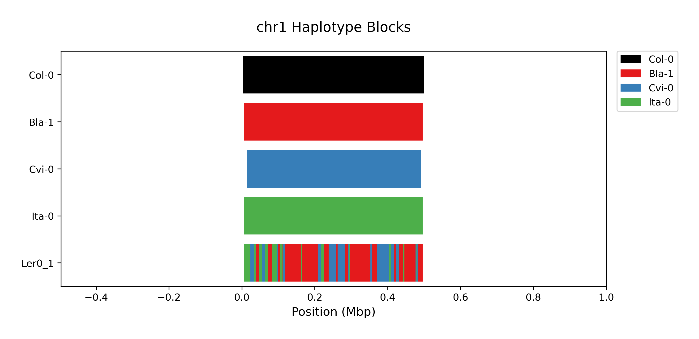
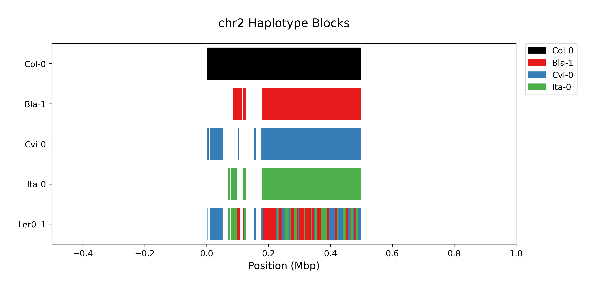
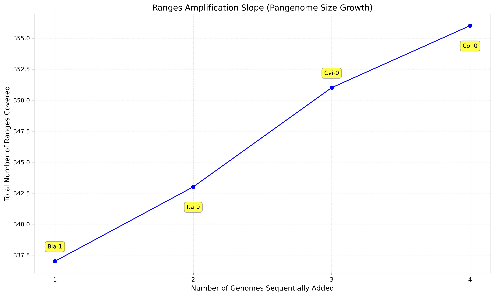
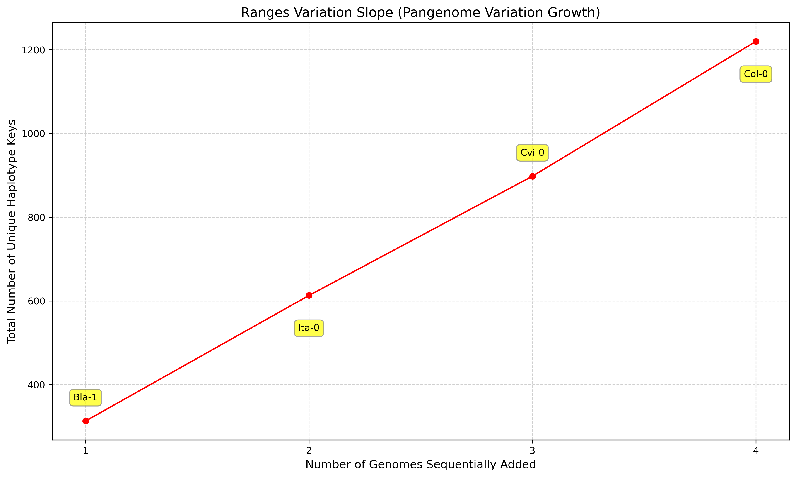
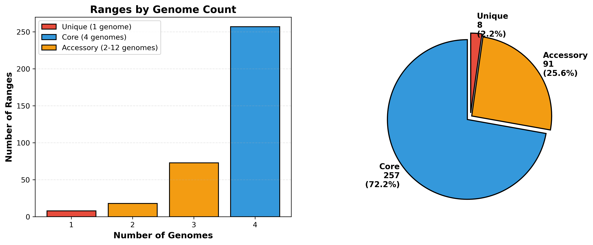
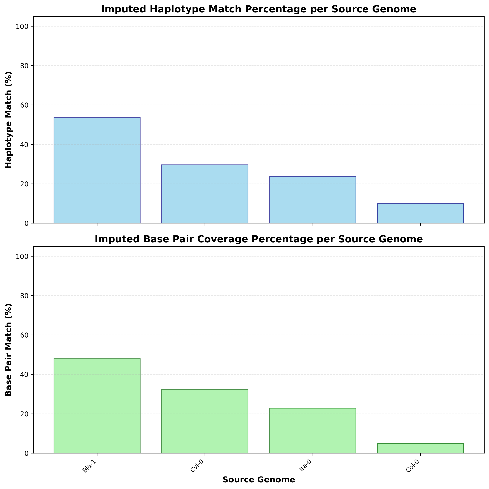
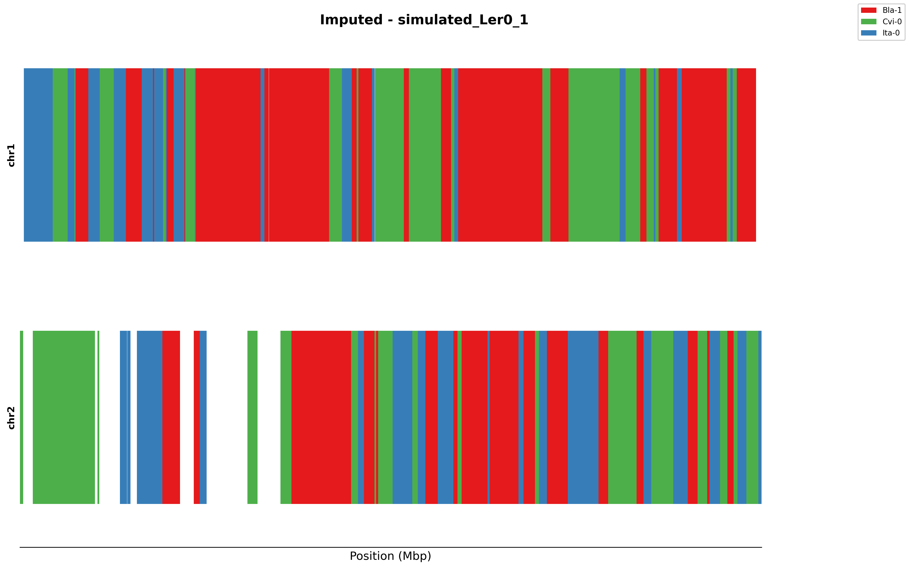
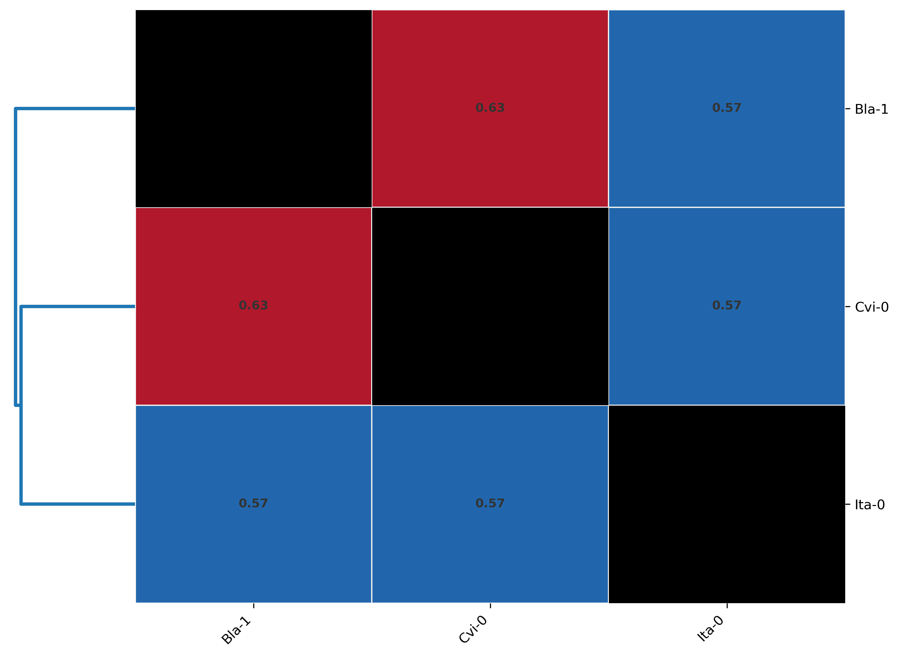

# PHG Example Database Workflow

This guide describes how to build and analyze a pangenome using PHG and PHGtools. Example commands and expected outputs are provided. Plots generated by the workflow are included for reference.

---

## 1. Check PHG Installation

```bash
conda activate phgv2-conda
phg --version
```


## 2. Building the Pangenome

```bash
mkdir data vcf_dbs output
```


### Inside `data/` directory:
```bash
cd data
```


Download your reference FASTA and annotation file:

- `Col0.fa`
- `Col0.gff`


Download your pangenome genome assemblies:

- `GCA_036942445.1.fa`
- `GCA_036942575.1.fa`
- `GCA_036942965.1.fa`


**Note:** This example uses Arabidopsis, but only the first 500,000 bp of the first two chromosomes. Files have been edited as follows:

```bash
awk '/^#/ || $5 <= 500000' data/Col0.gff > data/Col0_500kb.gff
sed 's/^/chr/' Arabidopsis_thaliana.TAIR10.58.gff3 > data/Col0.gff
awk '/^#/ || $5 <= 500000' data/Col0.gff > data/Col0_500kb.gff
sed -i 's/^chr#/#/' data/Col0_500kb.gff
grep -v "###" data/Col0_500kb.gff | grep -E "chr1|chr2" > data/Col-0.gff
```


## 3. Prepare Assemblies Keyfile

Example `data/assemblies_keyfile.txt`:

```
# file name	# new name
Col0.fa	Col-0
GCA_036942965.1.fa	Ita-0
GCA_036942445.1.fa	Bla-1
GCA_036942575.1.fa	Cvi-0
```


```bash
mkdir data/prepared_assemblies
phg prepare-assemblies --keyfile data/assemblies_keyfile.txt --output-dir data prepared_assemblies/ --threads 8
```


## 4. Create the Ranges File

```bash
phg create-ranges --gff data/Col0.gff --boundary gene -o output/ref_ranges --reference-file data/prepared_assemblies/Col-0.fa --range-min-size 500
```


Prepare the assemblies list to compress (`data/prepared_assemblies/assemblies_list.txt`):

```
data/prepared_assemblies/Bla-1.fa
data/prepared_assemblies/Col-0.fa
data/prepared_assemblies/Cvi-0.fa
Example `output/alignment_files/assemblies_align_keyfile.txt`:
## 13. PHGtools Functions

### 13.1 Painting and Visualization

#### Haplopainting
```bash
cp output/vcf_files_imputed/simulated_Ler0_1.h.vcf output/haplopainting/
phg export-vcf --db-path vcf_dbs/ --dataset-type hvcf --sample-file vcf_dbs/samples_names.txt -o output/haplopainting/
# or:
phg export-vcf --db-path vcf_dbs/ --dataset-type hvcf --sample-names Bla-1,Col-0,Cvi-0,Ita-0 -o output/haplopainting/
zcat vcf_dbs/hvcf_files/Col-0.h.vcf.gz > output/haplopainting/Col-0.h.vcf
phgtools haplopainting --hvcf-folder output/haplopainting/ --samples-list output/haplopainting/samples_list_keyfile.txt  --plot-pangenome-references --verb
```

Example `output/haplopainting/samples_list_keyfile.txt`:
```
Sort	Genotype	Group
1	Col-0	Reference
2	Bla-1	Pangenome
3	Cvi-0	Pangenome
4	Ita-0	Pangenome
5	Ler0_1	Imputed
```

**Example Plots:**



### 13.2 Analysis and Statistics

#### Range Pangenome Evolution
```bash
phgtools range-pangenome-evolution output/hapIDrange.tsv --reference Col-0
```
...existing code...
Plots:



#### Genome Intersection
```bash
phgtools genome-intersection --bed-file output/haplopainting/Ita-0.h.bed --genome-fasta data/prepared_assemblies/Ita-0.fa output/read_mappings/simulated_Ler0_1_1_readMapping.txt
```
...existing code...

#### Core Range Detector
```bash
phgtools core-range-detector output/example_pangenome.h.vcf
```
...existing code...
Plot:


#### Imputation Match Summary
```bash
phgtools check-imputated-haplotype vcf_dbs/hvcf_files/ output/vcf_files_imputed/simulated_Ler0_1.h.vcf
```
...existing code...
Plot:


#### Plot Imputed HVCF
```bash
phgtools plot-imputed-hvcf vcf_dbs/hvcf_files/ output/vcf_files_imputed/simulated_Ler0_1.h.vcf vcf_dbs/hvcf_files/Col-0.h.vcf.gz
```
Plot:


#### VCF Distance
```bash
phgtools vcf-distance output/example_pangenome.g.vcf --out-matrix output/distance_matrix.tsv --heatmap-plot output/distance_heatmap.png --threads 8
```
Plot:


### 13.3 Utility and Conversion

#### hvcf2bed
```bash
phgtools hvcf2bed output/vcf_files/
phgtools hvcf2bed output/vcf_files_imputed/
```
*Generates a bedfile representing the haplotype blocks.*

#### fasta-from-key
```bash
phgtools fasta-from-key --key 9b124928bfffebe27777ac72444a6de0 --fastas-folder data/prepared_assemblies/ --vcf-folder output/vcf_files/
```
...existing code...

#### Check Haplotype Alleles
```bash
phgtools check-haplotype-alleles output/hapIDrange.tsv  -s 1 -e 10000 -c chr1
```
...existing code...

```bash
phgtools haplopainting --hvcf-folder output/haplopainting/ --samples-list output/haplopainting/samples_list_keyfile.txt  --plot-pangenome-references --verb
```

#### Example Plots


# fasta-from-key
phgtools fasta-from-key --key 9b124928bfffebe27777ac72444a6de0 --fastas-folder data/prepared_assemblies/ --vcf-folder output/vcf_files/ 

>\>9b124928bfffebe27777ac72444a6de0_Bla-1@chr1:109800-110690
tttatattacAGGATCTGGGTGAAAAAAGAACAGTCTTTTGATTTGgtgtgtttctcttttctcttaattttttagGATT
TTTGTTGTGTCTTAATGAAATAATGGGAGCAGCTGAAGCAAGAGCATTGTGGCAAAGAACAGCTAGTCGTTGCTTTGTTG
TTCATGAGGATGCTAAGATGGCTCCGAGGTTAGCTTGTTGCCAACACCAACAATCTTCTTCGGGCAACACCGAAAAAAAC
AGCTTTTCTTCGGGAAGTTTTGGAGATTCCTCTGATTTCTCTTGTGATACCAAATGGTGGCTTAAGGGATCAACTGGATT
TGATGAGGAGGTTACAAACTCCTTTCTTGAAGATACCAAATGCAAGAAATTGCATGAATTTGTCGACTTAATCGGAatac
gagaagaagaagactacaGCTTTATTAGCAAGAAAGCTGACGCTACAACACCGTGGTGGAGAAGCACGACGGATAAAGAT
GAATTAGCTCTCATGGTGGCGACTAAATCGGTTGATCATAATATCCAGAATTGTGATCTTCCTCCACCTCAAAAACTCCA
CAAGAGTATTCACTCCTCGAGTGgagaaaaagggtttaaaacAGCGGTTAAATCGCCATGGAAGCAAGGAGTTTGGAAGG
ATCGGTTTGAGAGATCTTTGAGTTACAATGGTAGCACAGAGAGCAAGAACACGAGTCCAATGTCTTCCCCTAGAAGTGAT
GATCTAAGCAAAGGTCAGCTTTTAGAAGCACTAAGGCATTCTCAAACCAGGGCaagagaagcagagagagcAGCGAGAGA
AGCTTGCGCTGAGAAAGACCGTGTGATAACAATCTTGTTGAAACAAGCGAGTCAGATGTTGGCTTATAAGCAATGGTTAA
AGCTTCTTGAA


### Range Pangenome Evolution
```bash
phgtools range-pangenome-evolution output/hapIDrange.tsv --reference Col-0
```

**Example output:**

Analysis based on 356 total ranges and 4 samples.

**SUMMARY: Ranges Amplification (Pangenome Size)**

| Genome | Ranges in Genome | Cumulative Ranges |
|--------|------------------|-------------------|
| Bla-1  | 337              | 337               |
| Ita-0  | 343              | 343               |
| Cvi-0  | 344              | 351               |
| Col-0  | 356              | 356               |

**SUMMARY: Keys Variation (Pangenome Variation)**

| Genome | New Keys | Shared Keys | Cumulative Total |
|--------|----------|-------------|------------------|
| Bla-1  | 313      | 0           | 313              |
| Ita-0  | 300      | 10          | 613              |
| Cvi-0  | 285      | 18          | 898              |
| Col-0  | 322      | 34          | 1220             |

Plots:


### Genome Intersection
```bash
phgtools genome-intersection --bed-file output/haplopainting/Ita-0.h.bed --genome-fasta data/prepared_assemblies/Ita-0.fa output/read_mappings/simulated_Ler0_1_1_readMapping.txt
```

**Example output:**

Query genome from BED file: Ita-0  
Loading map_kmers keys: 1154it [00:00, 523777.39it/s]  
Present ranges: 34 / 310 (10.97%)

**GENOME COVERAGE STATISTICS**

| Statistic                | Value         |
|--------------------------|--------------|
| Actual genome length     | 1,000,000 bp |
| Pangenome coverage       | 846,950 bp (84.69%) |
| Read-mapped coverage     | 45,940 bp (4.59%)   |
| Uncovered genome         | 954,060 bp (95.41%) |


### Core Range Detector
```bash
phgtools core-range-detector output/example_pangenome.h.vcf
```

**Example output:**

*Total number of ranges: 356*
*Number of genomes: 4*
*Core ranges (present in all genomes): 257 (72.19%)*
*Unique ranges (present in 1 genome): 8 (2.25%)*
*Accessory ranges (present in 2-3 genomes): 91 (25.56%)*

Plot:


### Check Haplotype Alleles
```bash
phgtools check-haplotype-alleles output/hapIDrange.tsv  -s 1 -e 10000 -c chr1
```

**Example output:**

| CHROM | START | END   | Bla-1 | Col-0                                 | Cvi-0 | Ita-0                                 |
|-------|-------|-------|-------|----------------------------------------|-------|----------------------------------------|
| chr1  | 1     | 3630  | .     | <7ba58d3fb79e474dc69746e115e8c0c8>    | .     | .                                      |
| chr1  | 3631  | 5899  | <eeef5ba5dcb04510cba960114f1217ab> | <5548d9f54eb6fd9c7bf8dbbafe91e8e3> | .     | <4f8711b8b14e32f662a09246dc23eaf2>    |
| chr1  | 5900  | 6787  | <5b6a56958f60cb686db6dc0565069e3a> | <dab00238bf5efad6621e640cd2327947> | .     | <224f9bc8afa03c54abd52b1c54cb80c8>    |
| chr1  | 6788  | 9130  | <7c4e612019ce0c0b2322feaf027c6401> | <3bf90363699707ba63c55951f30ec5aa> | .     | <5b8ecd81b5638cd9c1949395b9f6bef6>    |
| chr1  | 9131  | 11648 | <076df9ad652cbb0d2d42549d6563407d> | <5a84770d937c11224cb7c8e28ec91029> | .     | <7ca41ed1df8c1365b47b96e730124a04>    |


### Imputation Match Summary
```bash
phgtools check-imputated-haplotype vcf_dbs/hvcf_files/ output/vcf_files_imputed/simulated_Ler0_1.h.vcf
```

**Example output:**

| Genome | Matches | Total | Match % | Imputed BP Covered | Matched BP Covered | Matched BP % |
|--------|---------|-------|---------|--------------------|--------------------|--------------|
| Bla-1  | 172     | 321   | 53.58   | 912694             | 436969             | 47.88        |
| Ita-0  | 76      | 321   | 23.68   | 912694             | 208643             | 22.86        |
| Cvi-0  | 95      | 321   | 29.60   | 912694             | 293730             | 32.18        |
| Col-0  | 32      | 321   | 9.97    | 912694             | 44779              | 4.91         |

Plot:


### Plot Imputed HVCF
```bash
phgtools plot-imputed-hvcf vcf_dbs/hvcf_files/ output/vcf_files_imputed/simulated_Ler0_1.h.vcf vcf_dbs/hvcf_files/Col-0.h.vcf.gz
```
Plot:


### VCF Distance
```bash
phgtools vcf-distance output/example_pangenome.g.vcf --out-matrix output/distance_matrix.tsv --heatmap-plot output/distance_heatmap.png --threads 8
```
Plot:


---

